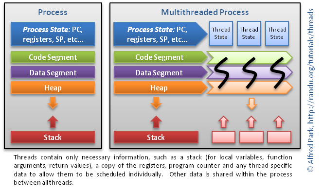

+++
title = "Cloud storage"
outputs = ["Reveal"]
+++

Go Course
Melbourne, May-June 2019

Cameron Hutchison
Daniel Cantos
Joshua Carpeggiani
Julia Ogris
Keilin Olsen
Ryan O'Kane
Sai Kiran Gummaraj

---
## Go Gopher

.caption [[https://blog.golang.org/gopher]]

---
## Course Overview

- Introduction to Go
- Go programming language
- Go standard library
- Go tool chaina
- Third party Go libraries commonly used
- JSON and RESTful API

Find Slides at [source](https://go-course.org) [anz-bank/go-slides](https://github.com/anz-bank/go-slides) on GitHub)


---
## Course Completion

- Complete the *Go* *Fundamentals* *Course* by finishing 5 lab assignments
- Complete the *Full* *Go* *Course* by finishing 10 lab assignments
- Complete the first lab assignments as described in these *slides*
- *Merge* your approved Pull Request (PR) to complete a lab assignment
- *Review* a colleague's PR and add a link to the review in your own PR description
- Submit your last PR before *15/7/2019* for a final re-review deadline on *31/7/2019*
- Receive a printed *certificate* if you complete 5 or 10 labs


---
## Talks

All talks take place at the Charles Goode Auditorium.
Attendance is optional.
The last 30 minutes of each talk are reserved for Q&A and help.

- 27 May 2019, 2-5pm: *Introduction* and *Lab* *Overview*
- 29 May 2019, 9-11am: *Values*, *Control* *Flow*, *Iterable* *Data* *Types* and *Range*
- 31 May 2019, 9-11am: *Functions*, *Data* *Structures* and *Interfaces*
- 7 June 2019, 9-11am: *Errors*, *Concurrency* and *Project* *Layout*
- 13 June 2019, 9-11am:*Toolchain*, *Standard* *Library*, *JSON* and *RESTful* *API*


---
## Prerequisites

- No prior Go knowledge required
- Some programming experience strongly recommended
- Basic understanding of *JSON* and *RESTful* *APIs* recommended
- Install [go 1.12](https://golang.org/doc/install)
- Install [golangci-lint](https://github.com/golangci/golangci-lint#install)


---
## Contact

Please join [#go-course](https://anzengineering.slack.com/messages/CFCPLHFT2/convo/CFCPLHFT2-1557100844.007600/) on [[https://anzengineering.slack.com]]

---
## Instructors
go-instructors@anz.com

[@camh](https://anzengineering.slack.com/team/U5PTX8C1F), Cameron.Hutchison@anz.com
[@Dan](https://anzengineering.slack.com/team/UCUUKEWGZ), Daniel.Cantos@anz.com
[@joshcarp](https://anzengineering.slack.com/team/UJC0EUZ3P), Joshua.Carpeggiani@anz.com
[@julia](https://anzengineering.slack.com/team/U84CTGB0F), Julia.Ogris@anz.com
[@keilin](https://anzengineering.slack.com/team/U8QFMQUJE), Keilin.Olsen@anz.com
[@ryanokane](https://anzengineering.slack.com/team/U7M6DMFMY), Ryan.O'Kane@anz.com
[@saikirian](https://anzengineering.slack.com/team/UC9C4K2ES), SaiKiran.Gummaraj@anz.com


---
## History and Overview


---
## History of Go

.caption [[https://xkcd.com/303/]]

2007: Robert Griesemer, Rob Pike, and Ken Thompson start working on Go at Google
2008: Russ Cox (go mod) and Ian Taylor (gcc frontend) join
2009: Go goes Open Source
2012: Go version 1.0


---
## What is Go?

- A simple language that is easy to learn and read
- Statically typed, but with a dynamic feel
- Compiled to native machine code, but has a fast development cycle
- Language-level concurrency features
- Comprehensive and clear standard library
- Garbage collected
- Unicode support
- Great tools
- Open source

(Source: [Go and the Zen of Python](https://talks.golang.org/2012/zen.slide#2))


---
## What does Go look like?

Hello world in Go
```go
	package main

	import (
		"fmt"
	)

	func main() {
		fmt.Println("Hello, Melbourne ☕️🎸🏈❤️")
	}
```

Execute with
```
go run hello.go

```

---
## What is Go NOT?

Go favours simplicity and directness resulting in some purposeful omissions:

- No type hierarchies or inheritance
- No exceptions
- No method overloading
- No generics
- No decorators
- No named or optional arguments
- No operator overloading
- No macros
- No arguments about code style :)


---
## Why Go

- simple: easy to learn and read
- a single obvious right way to do most things
- tools - `gofmt`, `goimports`, `godoc`, `go` `mod`, `go` `test`, `golangci-lint`, coverage
- standard library
- productive and fun
- lightweight concurrency

Here is a great read on Rob Pike's blog about "Why Go" - [Less is Exponentially More](https://commandcenter.blogspot.com/2012/06/less-is-exponentially-more.html)


---
## Demo


---
## Demo

- 2 seconds latency Pingserver
- Java Spring Boot implementation
- Go implementation
- Benchmark


---
## Java Spring Boot Initializr
```
	── build.gradle
	├── gradle
	│   └── wrapper
	│       ├── gradle-wrapper.jar
	│       └── gradle-wrapper.properties
	├── gradlew
	├── gradlew.bat
	├── settings.gradle
	└── src
	    ├── main
	    │   ├── java
	    │   │   └── com
	    │   │       └── anz
	    │   │           └── demo
	    │   │               └── pingserver
	    │   │                   ├── PingserverApplication.java
	    │   │                   └── controller
	    │   │                       └── PingController.java        <--------- THAT'S THE ONE
	    │   └── resources
	    │       └── application.properties
	    └── test
	          .....
		                                └── PingserverApplicationTests.java

```
---
## PingController.java

Source on [GitHub](https://github.com/anz-bank/go-slides/tree/master/pingserver/java)
```java
	package com.anz.dcx.serverdemo.controller;

	import org.springframework.http.MediaType;
	import org.springframework.web.bind.annotation.GetMapping;
	import org.springframework.web.bind.annotation.ResponseBody;
	import org.springframework.web.bind.annotation.RestController;

	@RestController
	public class PingController {

	    @GetMapping(path = "/ping", produces = MediaType.TEXT_PLAIN_VALUE)
	    @ResponseBody
	    String ping() throws Exception {
	        Thread.sleep(2000L);
	        return "pong";
	    }
	}
```
Execute with
```
	./gradlew clean bootRun
```

---
## Go Implementation
Source on [GitHub](https://github.com/anz-bank/go-slides/tree/master/pingserver/go)
```
├── go.mod
├── go.sum
└── main.go
```
Execute with
```
go run main.go
```

---
## Main.go
```go
	package main

	import (
		"fmt"
		"log"
		"net/http"
		"time"
	)

	func main() {
		http.HandleFunc("/ping", func(w http.ResponseWriter, r *http.Request) {
			time.Sleep(2000 * time.Millisecond)
			fmt.Fprint(w, "pong")
		})
		addr := ":9090"
		fmt.Println("Starting webserver on port", addr)
		log.Fatal(http.ListenAndServe(addr, nil))
	}
```

---
## Benchmark

- 19,000 concurrent requests
- Ubuntu 18.04 2.3GHz quad-core Intel Core i7
- Apache's `ab` command

  ab -n 19000 -c 19000 -s 200 -r localhost:8080/ping  ## Java
  ab -n 19000 -c 19000 -s 200 -r localhost:9090/ping  ## go

- Results

  Java median: 102.005 sec
  Java 95%:    135.280 sec

  Go median:   14.954 sec
  Go 95%:      15.061 sec

- Further details on [GitHub](https://github.com/anz-bank/go-slides/tree/master/pingserver#benchmark)

---
## Benchmark
- Range of concurrent requests from 1,000 to 19,000
  500 _

---
## Interlude: Towards Continuous Deployment


---
## What is Continuous Deployment (CD)?

Continuous Deployment != Continuous Delivery

.caption [Yassal Sundman, Continuous Delivery vs Continuous Deployment](https://blog.crisp.se/2013/02/05/yassalsundman/continuous-delivery-vs-continuous-deployment)


---
## Continuous Deployment Quotes

"Continuous Deployment is a strategy for software releases wherein any code commit that passes the automated testing phase is automatically released into the production environment."
[TechTarget definition](https://searchitoperations.techtarget.com/definition/continuous-deployment)


"Continuous deployment requires a highly developed culture of monitoring, being on call, and having the capacity to recover quickly."
[Marko Anastasov, Semaphore Engineering Blog](https://semaphoreci.com/blog/2017/07/27/what-is-the-difference-between-continuous-integration-continuous-deployment-and-continuous-delivery.html)


---
## Recommendations for CD (1/3)

- Use *trunk* *based* *development* (not GitFlow)
- Create *small* *PRs* (Pull Requests) that can be Squash Merged
- ... which lead to revertible commits that have passed automated tests
- Protect `master` branch on GitHub


---
## Recommendations for CD (2/3)

Quality leads to the confidence to automatically deploy, so we need
ways to increase and maintain quality.

- Write great commit messages
- Think about the reviewer and review your own PRs first
- *Lint* strictly `golangci-lint` `run`
- Ensure *100%* *coverage*


---
## Recommendations for CD (3/3)

- Test (unit & system), lint & cover as part of *CI* (Continuous Integration)
- *Version* all deployments (use [semver](https://semver.org/); tag source, images etc.)
- *Document* for newbies in the README.md (must!) and use godoc
- Enjoy your CD as last step after successful CI run on master


---
## Protect master branch on GitHub
```
Settings -> Options:
[ ] Allow merge commits
[x] Allow squash merging
[ ] Allow rebase merging

Settings -> Branches -> [Add rule|Edit] `master`:
[x] Require pull request reviews before merging
[x] Dismiss stale pull request approvals when new commits are pushed
[x] Require status checks to pass before merging
[x] Require branches to be up to date before merging
[x] Include administrators

```
---
## Commit messages

.caption [[https://xkcd.com/1296/]]


---
## Commit messages - spot the difference

[[https://chris.beams.io/posts/git-commit/]]

```
$ git log --oneline -5 --author cbeams --before "Fri Mar 26 2009"

e5f4b49 Re-adding ConfigurationPostProcessorTests after its brief removal in r814. @Ignore-ing the testCglibClassesAreLoadedJustInTimeForEnhancement() method as it turns out this was one of the culprits in the recent build breakage. The classloader hacking causes subtle downstream effects, breaking unrelated tests. The test method is still useful, but should only be run on a manual basis to ensure CGLIB is not prematurely classloaded, and should not be run as part of the automated build.
2db0f12 fixed two build-breaking issues: + reverted ClassMetadataReadingVisitor to revision 794 + eliminated ConfigurationPostProcessorTests until further investigation determines why it causes downstream tests to fail (such as the seemingly unrelated ClassPathXmlApplicationContextTests)
147709f Tweaks to package-info.java files
22b25e0 Consolidated Util and MutableAnnotationUtils classes into existing AsmUtils
7f96f57 polishing
```
versus
```
$ git log --oneline -5 --author pwebb --before "Sat Aug 30 2014"

5ba3db6 Fix failing CompositePropertySourceTests
84564a0 Rework @PropertySource early parsing logic
e142fd1 Add tests for ImportSelector meta-data
887815f Update docbook dependency and generate epub
ac8326d Polish mockito usage
```

---
## Recipe for great commit messages

[[https://chris.beams.io/posts/git-commit/]]

- Separate subject from body with a blank line
- Limit the subject line to 60 characters
- *Capitalize* the subject line
- Do not end the subject line with a period
- Use the *imperative* *mood* in the subject line
- Wrap the body at 80 characters
- Use the body to explain what and why vs. how


---
## Two git commands for precision work

- Use `git` `rebase` `-i` `COMMIT_HASH` to rework your commits if necessary
- Use `git` `add` `-p` for two separate concerns addressed in the one file

Don't be afraid!
Try it out on a new, throwaway branch.


---
## Rebase interactively
```
git log --oneline
58b250e WIP
d558e36 Add coverage and pre-pr checklist to README.md
c9724be Fix copyright holder in LICENCE
aa3b728 Added Apache 2.0 LICENSE
8a2fd40 Initial commit
```
Drop the latest commit, reword `Added...` to `Add` and fold in the `Fix...` commit with:

```bash
git rebase -i 8a2fd40
```
and update commits in your editor with:

```
reword aa3b728 Added Apache 2.0 LICENSE
fixup  c9724be Fix copyright holder in LICENCE
pick   d558e36 Add coverage and pre-pr checklist to README.md
drop   58b250e WIP
```

---
## Rebase a feature branch

Rebase will sequentially take the commits from `feature` and reapply them to `master`:
```
     A---B---C feature
    /
D---E---F---G master
```
will become
```
             A'--B'--C' feature
            /
D---E---F---G master
```

Use the following commands:
```bash
git checkout master
git pull upstream master ## or just `git pull` if `master` is set to track `upstream/master`
git checkout feature
git rebase master
git push -f
```

---
## Update branch on Github

For an existing PR you can alternatively click `Update` `branch` on Github.
This will merge `upstream/master` into `origin/feature`.
Before adding any commits to `feature` locally run:
```bash
git pull origin feature
```


---
## Pull Request (PR) recommendations (1/2)

- Choose a meaningful *PR* *title*, it will become your Squash Merge message
- Fill in *PR* *description* and reference an Issue for instance with #6
- Review the *Files* *changed* tab - many reviewers start here
- Review the *Commits* tab - some reviewers start here
- Review the *Checks* tab - all checks must pass


---
## Pull Request (PR) recommendations (2/2)

- Think of the reviewer: your code needs to be reviewable and that should be a prime concern when writing your code, commits and PRs
- Tag your PR Title with `[WIP]` if adjustments are needed
- Rework fixup commits with `git` `rebase` `-i`  `COMMIT_HASH` and force push
- Add reviewers and remove `[WIP]` tag when all of the above are met
- Delete branch once merged, especially when using a single remote (no forks)


---
## Go language fundamentals


---
## Tutorials, references and tools

- [Tour of Go](https://tour.golang.org/)
- [Go by example](https://gobyexample.com/)
- [Golangbot](https://golangbot.com/learn-golang-series/)
- [Go playground](https://play.golang.org/)
- [Go play space](https://goplay.space)
- [The Go Programming Language Specification](https://golang.org/ref/spec)
- [Stackoverflow](https://stackoverflow.com/questions/tagged/go?sort=votes&pageSize=100)


---
## Getting started

- [Packages](https://goplay.space/#cz9VBPWuHS3), imports and exported names
- [Functions](https://goplay.space/#FJKCetXBe2c)

_Notes:_
Keep your exported identifiers to as few as possible
Document them


---
## Basic types
```go
	bool

	string

	int  int8  int16  int32  int64
	uint uint8 uint16 uint32 uint64 uintptr

	byte // alias for uint8

	rune // alias for int32
	     // represents a Unicode code point

	float32 float64

	complex64 complex128

```
---
## Zero values
```bash
0      for numeric types
false  for the boolean type
""     for strings
nil    for pointers
```

---
## Values and control flow

- [Values](https://goplay.space/#TOqGA-5RjUi)
- [Variables](https://goplay.space/#ouELtOl07G0)
- [Constants](https://goplay.space/#Nc_taqy8IH2)
- [Type conversion](https://goplay.space/#LISrbZdkUsy)
- [For](https://goplay.space/#4IXB0oGgGsY)
- [If/Else](https://goplay.space/#AbYAd6LB2c3)
- [Switch](https://goplay.space/#GpoaMY8dboJ)


---
## Lab setup

---
## Prerequisites

- Install [git](https://git-scm.com/downloads)
- Install [go 1.12](https://golang.org/doc/install)
- Install [golangci-lint](https://github.com/golangci/golangci-lint#install)

---
## Repository setup

- Login to github.com
- Click `Fork` in the top right corner of [[https://github.com/anz-bank/go-course]]
- Clone your fork. `USERNAME` is your GitHub username:
```bash
git clone https://github.com/USERNAME/go-course.git
cd go-course
```
- Create `upstream` remote pointing to [anz-bank/go-course](https://github.com/anz-bank/go-course):
```bash
git remote add upstream https://github.com/anz-bank/go-course.git
git remote update
git branch -u upstream/master master
git pull
```

---
## PR from own fork - typical git workflow

Start work on a new branch `lab1` with:
```bash
git checkout master
git pull upstream master  ## with upstream/master tracking just use `git pull`
git checkout -b lab1
```
Write, test and commit code code, then:
```bash
git push -u origin
```
---
## Creating PRs

-  from `feature` branch of your own fork (remote `origin`)
-  to `master` on [anz-bank/go-course](https://github.com/anz-bank/go-course) (remote `upstream`)

Follow the [PR checklist](https://github.com/anz-bank/go-course#pre-pr-checklist) before submitting

When ready, submit and add the `Ready` `for` `review` tag

---
## Update feature branch

If `master` has advanced after `feature` branch and PR creation you have two options:

---
#Rebase* *feature* *branch*
```go
git checkout master
git pull upstream master ## or just `git pull` if `master` is set to track `upstream/master`
git checkout feature
git rebase master
git push -f
```
or

---
#Update* *branch* *on* *GitHub*

For an existing PR you can alternatively click `Update` `branch` on Github.
This will merge `upstream/master` into `origin/feature`.
Before adding any commits to `feature` locally run:
```bash
git pull origin feature
```
---
## Lab PR approval flow - Programmer

- Label with the appropriate lab tag (eg: `lab1`)
- When ready, label with `Ready` `for` `review`
- Wait for PR to be labelled `Approved` `by` `colleague` or `Changes` `requested`
- If approved by colleague, wait for a CODEOWNER to approve and label with `Merge` `me`
- Merge

---
## Lab PR approval flow - Reviewer

- Remove `Ready` `for` `review` and add `Under` `review`
- Label with either `Approved` `by` `colleague` or `Changes` `requested` and remove `Under` `review`


---
## Test samples

- [Basics](https://goplay.space/#HcgMVMtjWJo)
- [Multiple cases](https://goplay.space/#Zy2ta-z8vrO)
- [Testify](https://goplay.space/#dCbjRkHqm_3)
- [Suites](https://goplay.space/#XoXe-FUSoCD)

[Dave Cheney - table driven tests](https://dave.cheney.net/2019/05/07/prefer-table-driven-tests)


---
## Lab 1 - Fibonacci

- Create an executable go program in directory `01_fib/USERNAME`
- Write a function that prints the first n Fibonacci numbers

  func fib(n int)

- Call `fib(7)` in `main` to print
```bash
  1
  1
  2
  3
  5
  8
  13
```
- Bonus points: For negative n print [Negafibonacci numbers](https://en.wikipedia.org/wiki/Fibonacci_number#Negafibonacci).

---
## Iterable data types and Range

- [Arrays](https://goplay.space/#XrEt6YEl7QC)
- [Slices](https://goplay.space/#_KaPpZeRNPA)
- [Maps](https://goplay.space/#zBKEYY8UM5T)
- [Range](https://goplay.space/#FezVQTvmsqg)


---
## Lab 2 - Bubble sort

- Create an executable go program in directory `02_bubble/USERNAME`
- Write a function that returns a sorted copy of `int` slice `s` using [Bubble sort](https://en.wikipedia.org/wiki/Bubble_sort):

  func bubble(s []int) []int

- Call `fmt.Println(bubble([]int{3,` `2,` `1,` `5}))` in `main` to print:

  [1 2 3 5]

- Bonus points: implement [Insertion sort](https://en.wikipedia.org/wiki/Insertion_sort)
- Extra bonus points: implement an _O(n_ _log(n))_ sorting algorithm


---
## Lab 3 - Letter frequency

- Create an executable go program in directory `03_letters/USERNAME`
- Write a function that returns a mapping of each letter to its frequency:

  func letters(s string) map[rune]int

- Write a function that returns a sorted slice of strings with elements `"{key}:{val}"`. Use package [sort](https://golang.org/pkg/sort/):

  func sortLetters(m map[rune]int) []string

- Call `fmt.Println(strings.Join(sortLetters(letters("aba")),` `"\n"))` in `main` to print:

  a:2
  b:1

- Bonus points: comprehensive tests


---
## Functions

- [Functions](https://goplay.space/#gHOzTi05LkI): parameters and return values
- [Variadic Functions](https://goplay.space/#-G75RWA1DW1)
- [Closures](https://goplay.space/#olrpJoSte3n)


---
## Lab 4 - Numeronym

- Create an executable go program in directory `04_numeronym/USERNAME`
- Write a function that returns a slice of numeronyms for its input strings:

  func numeronyms(vals ...string) []string

- Call `fmt.Println(numeronyms("accessibility",` `"Kubernetes",` `"abc"))` in `main` to print:

  [a11y K8s abc]


---
## Data structures and interfaces

- [Pointers](https://goplay.space/#MYeoiSdP4tp)
- [Structs](https://goplay.space/#eoBLEu8lRvl)
- [Methods](https://goplay.space/#OkA4buOlTe1)
- [Interfaces](https://goplay.space/#An9Um8oSShm)

"The bigger the interface, the weaker the abstraction." - [Rob Pike](https://go-proverbs.github.io/)


---
## Embedding - Interfaces

"Go does not provide the typical, type-driven notion of subclassing, but it does have the ability to “borrow” pieces of an implementation by embedding types within a struct or interface." - [Effective Go](https://golang.org/doc/effective_go.html#embedding)


	type Reader interface {
	    Read(p []byte) (n int, err error)
	}

	type Writer interface {
	    Write(p []byte) (n int, err error)
	}

	// ReadWriter is the interface that combines the Reader and Writer interfaces.
	type ReadWriter interface {
	    Reader
	    Writer
	}


---
## Embedding - Structs

"When we embed a type, the methods of that type become methods of the outer type, but when they are invoked the receiver of the method is the inner type, not the outer one." - [Effective Go](https://golang.org/doc/effective_go.html#embedding)

- The same applies for all fields within an embedded type


---
## Precedence when Embedding

Embedding types introduces the possiblity for naming conflicts. Go follows some simple rules to help resolve this:

- A field or method `X` will hide any other field or method `X` found in a more deeply nested part of the type
- If a field or method appears at the same nesting level, it will return an error


---
## Examples

- [Embedded Structs](https://goplay.space/#lAl70x0QACE)
- [Embedded Interfaces](https://goplay.space/#vLgi3SMtLZp)
- [Precedence](https://goplay.space/#cmWFJ26jm2E)


---
## Lab 5 - Stringer

- Create an executable go program in directory `05_stringer/USERNAME`
- Make the `IPAddr` type implement `fmt.Stringer` to print the address as a dotted quad
- Find hints at [Tour of Go Exercise: Stringers](https://tour.golang.org/methods/18)
- Call `fmt.Println(IPAddr{127,` `0,` `0,` `1})` in `main` to print:

  127.0.0.1


---
## Go for Java devs

- [Functions are lambdas](https://goplay.space/#lQNE-kuVf-N)
- [Typed constants are enums](https://goplay.space/#HVSd6qpj74R)
- exported == public
- unexported == protected, not private
- There are no classes, though most types behave like them
- embedding == composition + inheritence
- map[type]struct{} == Set<type>
- [Beware of pointers](https://goplay.space/#cL8GEUOhlb5)
- [Pointers will also save your day](https://goplay.space/#UF61v58dVYT)


---
## Go for Java devs

- Not everything is object oriented. Pure functions are just fine
- Don't worry about abstraction up front, it is easy to abstract in go
- Don't worry about starting thousands of goroutines (worry when you get to millions)
- Don't worry about access scope within a package
- Don't worry about frameworks
- Don't worry about patterns
- Don't overstructure your project
- Remember to check for errors
- Don't fight the formatter
- Don't panic


---
## Test two implementations of interface in suite (1/2)

	// scaler.go
	type scaler interface {
		scale(float64)
	}

	type rect struct {
		a, b int
	}

	func (r *rect) scale(s float64) {
		r.a = int(float64(r.a) * s)
		r.b = int(float64(r.b) * s)
	}

	type circle struct {
		r int
	}

	func (c *circle) scale(s float64) {
		c.r = int(float64(c.r) * s)
	}


---
## Test two implementations of interface in suite (2/2)

	type scalerSuite struct {
		suite.Suite
		scaler scaler
	}

	func (s *scalerSuite) TestScaler() {
		r := assert.New(s.T())
		initial := fmt.Sprintf("%#v", s.scaler)

		s.scaler.scale(2.0)
		scaled := fmt.Sprintf("%#v", s.scaler)

		s.scaler.scale(0.5)
		scaledBack := fmt.Sprintf("%#v", s.scaler)

		fmt.Printf("%s\n%s\n%s\n", initial, scaled, scaledBack)
		r.Equal(initial, scaledBack)
		r.NotEqual(initial, scaled)
	}

	func TestStorer(t *testing.T) {
		suite.Run(t, &scalerSuite{scaler: &circle{2}})
		suite.Run(t, &scalerSuite{scaler: &rect{1, 1}})
	}


---
## Lab 6 - CRUD puppy with interface

- Create an executable go program in directory `06_puppy/USERNAME` (see [hints](https://github.com/anz-bank/go-samplerest/blob/master/pkg/pet/types.go))
- Implement a `Puppy` struct containing `ID`, `Breed`, `Colour`, `Value`.
- Create `Storer` interface with [CRUD](https://en.wikipedia.org/wiki/Create,_read,_update_and_delete) methods for `Puppy`
- Write a `MapStore` implementation of `Storer` backed by a `map`
- Write a `SyncStore` implementation of `Storer` backed by a [sync.Map](https://golang.org/pkg/sync/#Map)
- Keep all implementation files in the same folder and in package `main`
- Test against the `Storer` interface and run in [suite](https://godoc.org/github.com/stretchr/testify/suite) with both implementations

.caption J. D. Frazer "Illiad", User Friendly - [Crud Puppy](https://en.wikipedia.org/wiki/User_Friendly#Crud_Puppy)

---
## Error Handling in Go

---
## Errors in Go

- `error` is a builtin interface [source: error](https://golang.org/src/builtin/builtin.go?s=11246:11286#L251)
```
	type error interface {
		Error() string
	}
```
- Check errors explicitly

---
## Errors in Go (1/2)

- Create error values using [`errors.New()`](https://golang.org/src/errors/errors.go?s=293:320#L1):
  var ErrPermission = errors.New("permission denied")
- Alternatively using `fmt.Errorf`:
  return fmt.Errorf("archive/tar: missed writing %d bytes", nb)
- Exported error variables start with 'Err' (like ErrTimeout, ErrNotFound)

---
## Errors in Go (2/2)

- Create custom error types [source: AddrError](https://golang.org/pkg/net/#AddrError):
  type AddrError struct {
  Err  string
  Addr string
  }
  func (e *AddrError) Error() string {
  if e == nil {
  return "<nil>"
  }
  s := e.Err
  if e.Addr != "" {
  s = "address " + e.Addr + ": " + s
  }
  return s
  }
- Error values can be logged and printed:
  log.Println(err)

---
## Error Handling

- [Check for error](https://goplay.space/#X0qqmcrO6om)
- [Compare error values](https://goplay.space/#HiLw8Y_D_6T)
- [Compare error types](https://goplay.space/#CII8be9-TqW)
- [Program with error](https://goplay.space/#I6UJNHe6C7v)
- By convention many standard library functions return `error` as the second return value

"Errors are values."  - [Rob Pike](https://blog.golang.org/errors-are-values)

---
## Defer

- `defer` delays the execution of a function until the surrounding function returns
- When `defer` is called the parameters to the call are evaluated and saved
- Deferred functions are called when function returns or stack unwinds
- Syntax:
  defer <function call>
- Deferred functions are called [in reverse order](https://goplay.space/#ZX5S9xyOS57)
- Most commonly used for [resource cleanup](https://goplay.space/#mh9MhO9rDXt) (close IO resources, release locks etc.)

---
## Panic and Recover (1/2)

- `panic` and `recover` are builtin functions
- `panic` and `recover` behave similar to `throw/catch` in other languages
- `panic`:
  func panic(interface{})
- `panic` unwinds the stack, calling deferred functions up to the top-level function of the executing goroutine
- `recover` (see next slide) can intercept this unwinding
- Without `recover`, the program is terminated and the error condition is reported

---
## Panic and Recover (2/2)

- `recover`:
  func recover() interface{}
- `recover` allows a program to handle panic called in another function
- Must be called from within a deferred function in the same goroutine
- Returns the value passed by call to panic

---
## Don't Panic

- Panic could terminate the goroutine or the program
- Use `panic` rarely and judiciously in your own code
- Use it in deeply nested internal methods/functions and return an error/status to the caller
- Don't `panic` across package boundaries
- Don't make a panic part of a package's API, instead always recover at the interface level of the package and return an error
- [Basic illustration of panic](https://goplay.space/#fFiO42mIOHo)
- [Basic illustration of panic and recover](https://goplay.space/#c8XO7QBMfA5)
- [Recover and return value](https://goplay.space/#V5ckmhsPUHv)

---
## Lab 7 - Errors

- Create an executable go program in directory `07_errors/USERNAME`
- Copy the CRUD puppy from upstream master `06_puppy/USERNAME`
- Add a custom error type `Error` with fields `Message` and `Code`
- Extend the `Storer` interface for all methods to also return `error`
- Create errors for:
    - Value < 0
    - ID not found in Read, Update and Delete

- Add locking for proper use of sync.Map
- Bonus points: Add a third `Storer` implementation using [LevelDB](https://github.com/syndtr/goleveldb)

---
## Go Concurrency

---
## Topics

- Concurrency
- Concurrency in Go
- Goroutines
- Channels
- Range & Select
- Under the hood: Processes, Threads, Goroutines
- Under the hood: Go Runtime

---
## Concurrency

Definition

- Concurrency is the ability of different parts or units of a program, algorithm, or problem to be executed out-of-order or in partial order, without affecting the final outcome [Source: Wikipedia](https://en.wikipedia.org/wiki/Concurrent_computing)
- Parallelism is the ability to run different parts or units of a program simultaneously

[Rob Pike](https://go-proverbs.github.io/) [Talk](https://www.youtube.com/watch?v=cN_DpYBzKso), [Slides](https://talks.golang.org/2012/waza.slide)

- "Don't communicate by sharing memory, share memory by communicating."
- "Concurrency is not parallelism."
- "Concurrency is about structure, parallelism is about execution."

---
## Concurrency in Go

Go provides:

- Concurrent execution (goroutines)
- Synchronisation and message passing (channels)
- Multi-way concurrent control (select)

---
## Goroutines

- Goroutine is an extremely lightweight thread of execution
- Low initial stack size (2 Kb) that grows
- Runs concurrently like threads
- Start a goroutine [using the 'go' statement](https://play.golang.org/p/Xp-QlM1nTGC)
  go <function-call>

---
## Channels

- Communication mechanism (conduit) that lets goroutines exchange data
- Each channel allows goroutines to send/receive a particular data type (called element type)
- Declare channel using `chan` keyword
- Create unbuffered channel
  ch := make(chan int) // ch is an unbuffered channel of `int` element type
- Create buffered channel
  ch := make(chan int, 10) // ch is a buffered channel of size 10 and type `int`
- Close channel using `close()` function

---
## Channel Operations (1/2)

- Send and Receive values with the channel operator <-

  ch <- v // send v to the channel ch
  v := <-ch // receive from ch and assign it to v

- Send to buffered channel blocks only when the channel is full
- Receive from a channel blocks when the channel is empty
- Sender can close the channel to indicate no more values will be sent
- Receiver can test whether a channel has been closed

  v, ok := <-ch // ok is false if channel is closed and no more data is available

- Sending message on a closed/nil channel causes the program to panic
- Receive on a closed channel never blocks

---
## Channel Operations (2/2)

- Range on a channel

  for v := range ch {
  fmt.Println(v)
  }

- Range over a channel that never closes never finishes

---
## select Statement

- Allows composing of channels
- Chooses which set of possible "send" or "receive" operations will proceed

  var ch1, ch2 chan int
  select {
  case ch1 <- 1:
  fmt.Println("1 sent on ch1")
  case x, ok := <-ch2:
  if ok {
  fmt.Printf("%v received on ch2", x)
  } else {
  fmt.Println("ch2 is closed")
  }
  default:
  fmt.Println("no communication")
  }

---
## Under the hood: Process, Threads and OS Scheduling

.caption [[https://randu.org/tutorials/threads/]]

- Large (default 2 Mb on Linux) stack size
- 1x1 mapping between user and kernel threads

---
## Under the hood: Go Runtime

- Scheduling, Memory Management, Garbage Collection
- Scheduler tracks goroutines and schedules them to run on a set of OS threads
- GOMAXPROCS and runtime.GOMAXPROCS() sets the number of OS threads

.caption [Analysis of the Go runtime scheduler](http://www1.cs.columbia.edu/~aho/cs6998/reports/12-12-11_DeshpandeSponslerWeiss_GO.pdf)

---
## Channel Examples

- [Send and receive on an unbuffered channel](https://play.golang.org/p/dIQTgdZ2kvQ)
- [Send and receive on a buffered channel](https://play.golang.org/p/DVkhMmqfs_x)
- [Receive from a channel using 'range'](https://play.golang.org/p/840nqny9Y4D)
- [Timeout with 'select'](https://play.golang.org/p/BQtEdOoAjoZ)

---
## Tools and Conventions

---
## Project layout

For non-trivial size projects follow the layout suggested by [golang-standards](https://github.com/golang-standards/project-layout)
Abridged version:
```bash
	├── README.md
	├── go.mod
	├── go.sum
	├── cloudbuild.yaml
	├── .gitignore
	├── .golangci.yml
	├── pkg
	│   ├── bar
	│   │   ├── bar.go
	│   │   ├── baz.go
	│   │   └── bar_test.go
	│   └── foo
	│       ├── foo.go
	│       └── foo_test.go
	├── cmd
	│   └── fooserver
	│       └── main.go
	├── docs
	└── vendor
```

---
## Lab 8 - Project Layout

- Copy the CRUD puppy from upstream master `07_errors/USERNAME`
- Create directory `08_project/USERNAME` containing
```bash
  ├── README.md
  ├── pkg
  │   └── puppy
  │       ├── types.go
  │       ├── types_test.go
  │       ├── errors.go
  │       ├── errors_test.go
  │       └── store
  │           ├── storer.go
  │           └── .... store files and tests, e.g. mapstore.go
  └── cmd
  └── puppy-server
  └── main.go
```
- Add project introduction and how to build, run & test it to `README.md`


---
## Go tool chain

```bash
	go help
	go version
	go build ./...
	go test ./...
	go install ./...
	go mod init
	go mod vendor
	go mod tidy
	go clean -modcache
	go test -coverprofile=coverage.out ./... && go tool cover -html=coverage.out

```
---
## Other tools

Lint with
```bash
golangci-lint run
```
and configure the linter in `.golangci.yml`

Use `gofmt` or `goimport` as part of your editor/IDE setup


---
## Go standard library

[[https://golang.org/pkg/]]
- fmt
- strings
- time
- [encoding/json](https://goplay.space/#zp5qANw7LCZ)
- net/http
- regexp
- sort
- database/sql
- os
- path
- bytes
- ...


---
## JSON - (De-)Serialisation

- `Marshal` converts a value into a JSON byte array
- `Unmarshal` converts a JSON-encoded byte array into a value
- An `Encoder` marshals values as JSON to a stream (`io.Writer`)
- A `Decoder` unmarshals JSON-encoded values from a stream (`io.Reader`)

  func Marshal(v interface{}) ([]byte, error) { /* ... */ }

  func Unmarshal(data []byte, v interface{}) error { /* ... */ }


---
## JSON - Field Tags

- Attach a 'json' field tag to customise (un)marshalling
- Common error is making Go fields private (lower case) which results in the fields not being (un)marshalled

```go
type Car struct {
    Manufacturer string `json:"manufacturer"`
    Model        string `json:"model"`
    Year         int64  `json:"year,omitempty"`
}
```

---
## JSON - Zero Values

- All Go struct fields will be set to their type's zero value if the corresponding JSON property is missing.
- Pointer types have a zero value of `nil`
- To be able to differentiate between a field which has been set explicitly to it's zero value or omitted, you must use pointer types


---
## Examples

- [JSON Marshal / Unmarshal](https://goplay.space/#lYdq4Jg19EP)
- [JSON Zero Values](https://goplay.space/#KkPDLf_PvQP)


---
## Lab 9 - JSON puppy

- Create directory `09_json/USERNAME` containing a copy of upstream master `08_project/USERNAME`
- Add JSON tags to puppy data type
- Test marshalling and unmarshalling using [require.JSONEq](https://godoc.org/github.com/stretchr/testify/require#JSONEq)
- Add command line flag `-d` `FILE` with long form `--data` `FILE` using [kingpin.v2](https://godoc.org/gopkg.in/alecthomas/kingpin.v2). FILE should contain an array of puppies in JSON format. Parse this file and store its contents.


---
## Useful third party packages

[testify](https://godoc.org/github.com/stretchr/testify) - testing toolkit
[chi](https://godoc.org/github.com/go-chi/chi) - lightweight router for Go HTTP services
[kingpin.v2](https://godoc.org/gopkg.in/alecthomas/kingpin.v2) - command line and flag parser
[logrus](https://godoc.org/github.com/sirupsen/logrus) - structured logger

[pq](https://godoc.org/github.com/lib/pq) - Postgres driver for the database/sql
[redigo](https://godoc.org/github.com/gomodule/redigo/redis) - lightweight client for Redis
[mgo](https://godoc.org/github.com/globalsign/mgo) - MongoDB driver for Go
[goracle](https://godoc.org/gopkg.in/goracle.v2) - Oracle driver for the database/sql

[jsonschema](https://github.com/santhosh-tekuri/jsonschema) - JSON schema compilation and validation
[go-jose](https://godoc.org/gopkg.in/square/go-jose.v2) - JWT utils
...


---
## A RESTful API starter (1/3)

Full sample code on Go Play Space -
not executable to due 3rd party dependency `chi`:
[basic sample](https://goplay.space/#YJqaOpvxiKT)
[sample with error handling](https://goplay.space/#aXy28QMEiNK)
```go
type TeapotHandler interface {
    handlePost(w http.ResponseWriter, r *http.Request)
    handleGet(w http.ResponseWriter, r *http.Request)
}

func SetupRoutes(r chi.Router, h TeapotHandler) {
    r.Post("/api/teapot", h.handlePost)
    r.Get("/api/teapot/{id}", h.handleGet)
}

func main() {
    r := chi.NewRouter()
    h := NewMapTeapotHandler()
    SetupRoutes(r, h)
    http.ListenAndServe(":7735", r)
}
```

---
## A RESTful API starter (2/3)
```go
type Teapot struct {
    ID          int
    Colour      string
    Temperature int
}

// MapTeapotHandler implements TeapotHandler
type MapTeapotHandler struct {
    store map[int]Teapot  // Race condition
    maxID int
}

func NewMapTeapotHandler() *MapTeapotHandler {
    return &MapTeapotHandler{store: map[int]Teapot{}}
}
```

---
## A RESTful API starter (3/3)
```go
// MapTeapotHandler implements  TeapotHandler
func (mt *MapTeapotHandler) handleGet(w http.ResponseWriter, r *http.Request) {
    id, _ := strconv.Atoi(chi.URLParam(r, "id"))
    teapot, _ := mt.store[id]
    render.JSON(w, r, teapot)
}

func (mt *MapTeapotHandler) handlePost(w http.ResponseWriter, r *http.Request) {
    var teapot Teapot
    render.DecodeJSON(r.Body, &teapot)
    mt.maxID++ // Race condition
    teapot.ID = mt.maxID
    mt.store[mt.maxID] = teapot
    render.JSON(w, r, teapot)
}
```

---
## Lab 10 - Puppy REST

- Create directory `10_rest/USERNAME` containing a copy of upstream master `09_json/USERNAME`
- Add file `pkg/puppy/rest.go` implementing:

  GET    /api/puppy/{id}
  POST   /api/puppy/          Payload: Puppy JSON without ID
  PUT    /api/puppy/{id}      Payload: Puppy JSON without ID
  DELETE /api/puppy/{id}

- Use [net/http/httptest](https://golang.org/pkg/net/http/httptest/) for testing
- Add flag `-p` `PORT` with long flag `--port` `PORT` to command line flags
- Add flag `-s` `STORE` with long flag `--store` `STORE` with accepted values:

  map, sync, db

- Document the API in README.md


---
## Lab 11 - Puppy Notifications

- Create directory `11_notify/USERNAME` containing a copy of upstream master `10_rest/USERNAME`
- Create `cmd/lostpuppy-service/main.go` running single endpoint:

  POST   /api/lostpuppy/          Payload: { id: PUPPY_ID }

- This stubbed endpoint returns with 2 second delay:

  HTTP status 201 for even IDs
  HTTP status 500 for odd IDs

- Update Puppy `Delete` method to notify lostpuppy-service in a goroutine and log response code asynchronously.


---
## Further project work

- [[https://github.com/anz-bank/go-samplerest]]
- [[https://github.com/anz-bank/decimal]]

---
## Future of Go

- Goal to fix the most significant ways Go 1 fails to scale.
- Based on [Experience Reports](https://github.com/golang/go/wiki/ExperienceReports) 3 pain points were identified
- Dependency Management (Addressed via Go Modules from version 1.11 onwards)
- Error handling
- Generics

Rob Pike's Talk [Towards Go 2](https://blog.golang.org/toward-go2)
Dave Cheney Blog [Past Present and Future of Go](https://dave.cheney.net/paste/the-past-present-and-future-of-go2.pdf)


---
## Further Reading

- [Package management with go modules](https://blog.golang.org/using-go-modules)
- [Writing plugins in go](https://appliedgo.net/plugins/)
- [Code coverage with go test](https://blog.golang.org/cover)
- [Benchmarking your code](https://dave.cheney.net/2013/06/30/how-to-write-benchmarks-in-go)
- [CPU/Memory Profiling](https://golang.org/pkg/runtime/pprof/)


---
## References

- [https://golang.org/doc/faq](https://golang.org/doc/faq)
- [Wikipedia](https://en.wikipedia.org/wiki/Go_(programming_language))
- [The Evolution of Go](https://talks.golang.org/2015/gophercon-goevolution.slide)
- [https://talks.golang.org/2012/zen.slide](https://talks.golang.org/2012/zen.slide)
- [Talk: A Tour of Go](https://www.youtube.com/watch?v=ytEkHepK08c)


---
## Feedback
